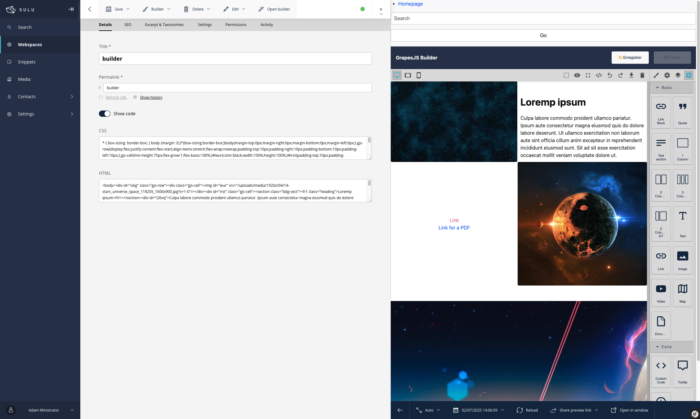
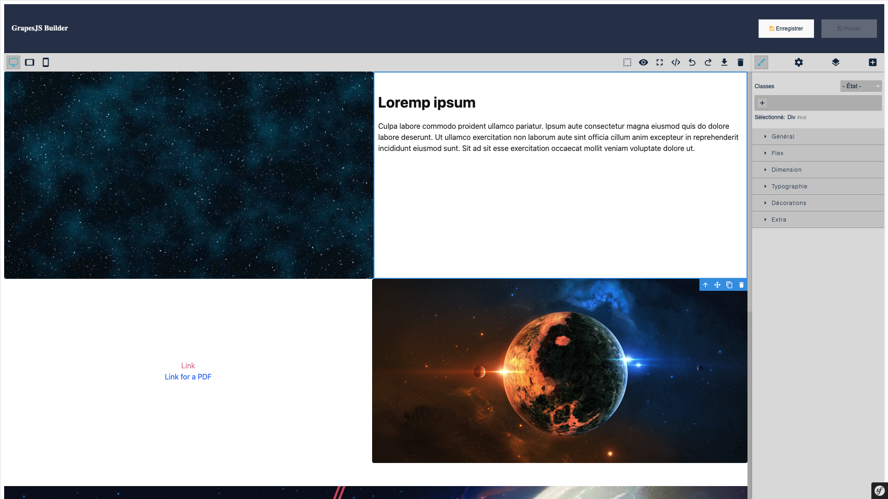
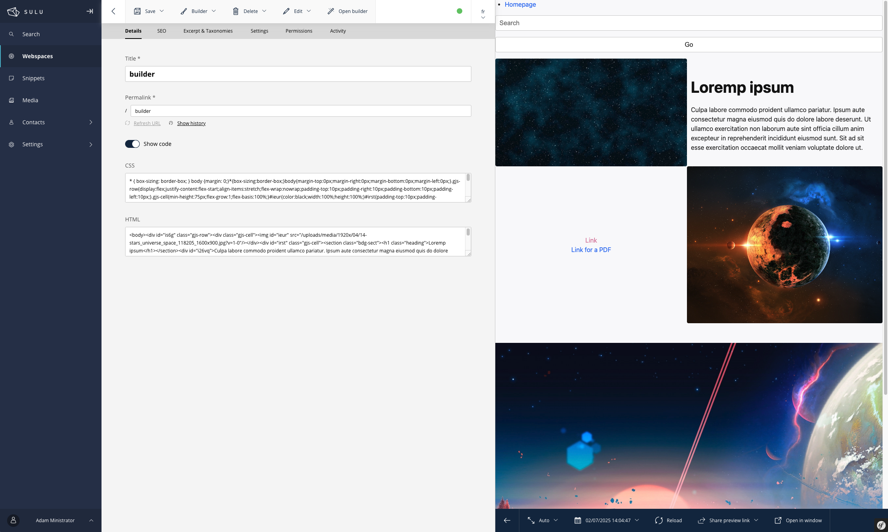
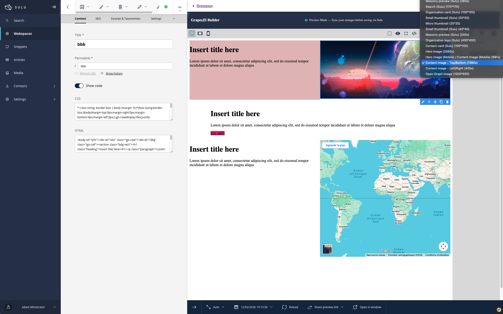

<div align="center">
    
</div>

<h1 align="center">GrapesJS Bundle for <a href="https://sulu.io" target="_blank">Sulu</a></h1>

<h3 align="center">Developed by <a href="https://github.com/steeven-th" target="_blank">Steeven THOMAS</a></h3>
<p align="center">
    <a href="LICENSE" target="_blank">
        
    </a>
    <a href="https://sulu.io/" target="_blank">
        
    </a>
</p>
SuluGrapesJsBundle extends the Sulu CMS to offer GrapesJS editor integration in Sulu Admin for content editing

## 📂 Requirements

* PHP ^8.2
* Sulu ^3.0.*

## 🛠️ Features

* Add Builder template page in Sulu Admin
* GrapesJS integration in Sulu Admin for content editing **(only BODY content)**
* Builder integrated in Sulu Preview with live synchronization (changes are synced to the Sulu form, enabling save/publish via the Sulu toolbar)
* Optional standalone builder mode (opens the editor in a separate tab)
* Asset Manager in Builder:
  * **Preview mode**: Uses the native Sulu media overlay (browse collections, search, pagination built-in) for both images and documents
  * **Standalone mode**: Enhanced GrapeJS Asset Manager with pagination (20 items/page), search, and one entry per media
  * `data-media-id` attribute is automatically set on inserted images and document links
* **Image Format Selector**: When an image from Sulu is selected, a "Format" dropdown appears in the component settings panel (below "Alt text"), listing all Sulu image formats with their dimensions. Allows switching between the original image and any configured thumbnail format directly from the editor

## 🇬🇧 Available translations

* English
* French
* German

## 📦 GrapesJS Dependencies

* [GrapesJS Open Source Editor](https://grapesjs.com/docs/)
* [GrapesJS blocks basic](https://github.com/GrapesJS/blocks-basic)
* [GrapesJS style bg](https://github.com/GrapesJS/style-bg)
* [Grapick](https://github.com/artf/grapick)
* [GrapesJS custom code](https://github.com/GrapesJS/components-custom-code)
* [GrapesJS tooltip](https://github.com/GrapesJS/components-tooltip)
* [GrapesJS typed](https://github.com/GrapesJS/components-typed)
* [GrapesJS style-filter](https://github.com/GrapesJS/style-filter)
* [GrapesJS countdown](https://github.com/GrapesJS/components-countdown)
* [GrapesJS tui image editor](https://github.com/GrapesJS/tui-image-editor)
* [GrapesJS object fit](https://github.com/steeven-th/grapesjs-object-fit)
* [GrapesJS rte toolbar extensions](https://github.com/steeven-th/grapesjs-rte-toolbar-extensions)

## 📝 Installation

### Composer
```bash
composer require itech-world/sulu-grapesjs-bundle
```

### Symfony Flex
If you don't use Symfony Flex, you can add the bundle to your `config/bundles.php` file:
```php
return [
    // ...
    ItechWorld\SuluGrapesJsBundle\ItechWorldSuluGrapesJsBundle::class => ['all' => true],
];
```

### Symfony symlink

```bash
php bin/console assets:install --symlink
```

### Configuration

The bundle requires no specific configuration for basic usage. Image formats are fetched dynamically from the Sulu API.

> **Note:** In preview mode, the GrapeJS canvas automatically inherits all stylesheets and scripts loaded by Sulu's preview system. No additional configuration is needed — your frontend styles are applied to the canvas content out of the box.

> **Breaking change:** The `images_formats` configuration option has been removed. Image formats are now retrieved dynamically from the Sulu API (`/admin/api/formats.json`). If your `config/packages/itech_world_sulu_grapejs.yaml` still contains `images_formats`, remove it to avoid a Symfony configuration error.

#### Detached preview media behavior

When the Sulu preview is detached (opened in a separate window), the native Sulu media overlay opens in the admin window — which may not be visible. By default, the custom GrapeJS Asset Manager (with pagination and search) is used instead.

To force the native Sulu overlay even in detached mode:
```yaml
itech_world_sulu_grapes_js:
    detached_preview_native_media: true  # default: false
```

#### ***BACK***

Edit the `config/routes.yaml` file to add the bundle to the list of routes:
```yaml
itech_world_sulu_grapesjs:
    resource: '@ItechWorldSuluGrapesJsBundle/src/Controller/'
    type: attribute
```

Edit the `assets/admin/package.json` to add the bundle to the list of bundles:
```json
{
    "dependencies": {
        // ...
        "sulu-itech-world-sulu-grapesjs-bundle": "file:../../vendor/itech-world/sulu-grapesjs-bundle/public/js"
    }
}
```

Edit the `assets/admin/app.js` to add the bundle in imports:
```js
import 'sulu-itech-world-sulu-grapesjs-bundle';
```

In the `assets/admin/` folder, run the following command:
```bash
npm install
npm run build
```

or

```bash
yarn install
yarn build
```

## 🖼️ Builder in Preview (Recommended)

The recommended way to use the GrapeJS editor is directly inside the Sulu Preview panel. Changes made in the editor are automatically synchronized with the Sulu form, so you can save and publish using the native Sulu toolbar buttons.

**How it works:**
- An info banner replaces the save/publish buttons in preview mode (no duplicates with Sulu's own buttons)
- Every edit silently marks the Sulu form as "dirty" (you'll get the "unsaved changes" warning when navigating away)
- Use the **Sync** button or **Ctrl+S / Cmd+S** to explicitly push changes to the Sulu form (triggers a preview refresh)
- When you click **Save** in Sulu, pending builder changes are automatically injected before saving — even without clicking Sync



The `BuilderContentController` automatically injects all required variables (`publish_state`, `translations`, `frontend_css_path`, `frontend_js_path`, `template`, `webspace`, `locale`, `id`) into the template context for both frontend rendering and preview mode.

In preview mode, when the user opens the Asset Manager (double-click on an image or click "Choose a document"), the native Sulu media selection overlay opens instead of the basic GrapeJS panel. This gives access to all media collections, search, and pagination natively.

To enable the GrapeJS editor in preview, create a `templates/bundles/SuluWebsiteBundle/Preview/preview.html.twig` file with the following content:
```twig



    {{ parent() }}
    
        
    



    
        
        
    
        {{ parent() }}
    



    {{ parent() }}
    
        
    

```

> **Note:** The variables `locale`, `webspace`, `id`, `translations`, `frontend_css_path`, `frontend_js_path`, and `previewContentReplacer` are automatically available in the template context thanks to `BuilderContentController`. You only need to explicitly pass `json_builder_html` and `json_builder_css` from the `content` object.

## 🔧 Standalone Builder (Optional)

If you prefer to open the GrapeJS editor in a separate tab instead of using the preview, you can enable the standalone builder mode. This adds an "Open Builder" button in the Sulu Admin toolbar for pages using the `builder` template.

In your `config/packages/itech_world_sulu_grapejs.yaml`:
```yaml
itech_world_sulu_grapes_js:
    enable_standalone_builder: true
    frontend_css_path: '/styles/app.css' # Required for standalone: path to the front CSS file
    frontend_js_path: '/js/app.js' # Required for standalone: path to the front JS file
```

> **Important:** `frontend_css_path` and `frontend_js_path` are **only needed for standalone mode**. The standalone builder opens in a separate tab outside of Sulu's preview, so it cannot auto-detect frontend assets. You must provide the paths manually. In preview mode, assets are detected automatically.

Then clear the admin cache:
```bash
php bin/adminconsole cache:clear
```

In standalone mode, the builder has its own Save and Publish buttons that communicate directly with the Sulu API.

> **Note:** Both modes can coexist. When `enable_standalone_builder` is `true`, the builder is available both in preview and via the toolbar button.





## 🖼️ Image Format Selector

When an image inserted via the Sulu media library is selected in the editor, a **Format** dropdown appears in the component settings panel (traits), right below the "Alt text" field. It lists all image formats configured in your `image-formats.xml`, along with their scale dimensions.

| Scenario | Behavior |
|----------|----------|
| Image from Sulu (just selected) | Dropdown populated immediately with "Original" + all Sulu formats |
| Image from Sulu (loaded from saved HTML) | Thumbnails fetched on selection via API, dropdown populates after a brief loading state |
| Image without `data-media-id` (manual URL) | Format dropdown is hidden |
| Format changed in dropdown | `src` attribute is updated, canvas reflects the new resolution |
| "Original" selected | Reverts to the full-resolution URL |



## 🐛 Bug and Idea

See the [open issues](https://github.com/steeven-th/SuluGrapesJsBundle/issues) for a list of proposed
features (and known issues).

## 💰 Support me

You can buy me a coffee to support me **this plugin is 100% free**.

[Buy me a coffee](https://www.buymeacoffee.com/steeven.th)

## 👨‍💻 Contact

<a href="https://steeven-th.dev"></a>
<a href="https://x.com/ThomasSteeven2"></a>

## 📘&nbsp; License

This bundle is under the [MIT License](LICENSE).
