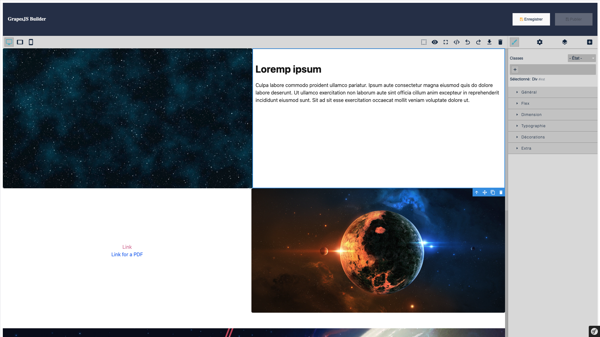

<div align="center">
    
</div>

<h1 align="center">GrapesJS Bundle for <a href="https://sulu.io" target="_blank">Sulu</a></h1>

<h3 align="center">Developed by <a href="https://github.com/steeven-th" target="_blank">Steeven THOMAS</a></h3>
<p align="center">
    <a href="LICENSE" target="_blank">
        
    </a>
    <a href="https://github.com/steeven-th/SuluGrapesJsBundle/releases" target="_blank">
        
    </a>
    <a href="https://sulu.io/" target="_blank">
        
    </a>
</p>
SuluGrapesJsBundle extends the Sulu CMS to offer GrapesJS editor integration in Sulu Admin for content editing

## 📂 Requirements

* PHP ^8.2
* Sulu ^2.6.*

## 🛠️ Features

* Add Builder template page in Sulu Admin
* GrapesJS integration in Sulu Admin for content editing **(only BODY content)**
* Builder button in Sulu Admin for open a new tab with the Builder
* Builder in Sulu Preview **(⚠️ Experimental approach – works, but not recommended for production)**
* Asset Manager in Builder **(ℹ️ Currently, you have access to all images and documents from Sulu. Soon, we will add video from Sulu and Youtube)**

## 🇬🇧 Available translations

* English
* French
* German

## 📦 GrapesJS Dependencies

* [GrapesJS Open Source Editor](https://grapesjs.com/docs/)
* [GrapesJS blocks basic](https://github.com/GrapesJS/blocks-basic)
* [GrapesJS style bg](https://github.com/GrapesJS/style-bg)
* [Grapick](https://github.com/artf/grapick)
* [GrapesJS custom code](https://github.com/GrapesJS/components-custom-code)
* [GrapesJS tooltip](https://github.com/GrapesJS/components-tooltip)
* [GrapesJS typed](https://github.com/GrapesJS/components-typed)
* [GrapesJS style-filter](https://github.com/GrapesJS/style-filter)
* [GrapesJS countdown](https://github.com/GrapesJS/components-countdown)
* [GrapesJS tui image editor](https://github.com/GrapesJS/tui-image-editor)
* [GrapesJS object fit](https://github.com/steeven-th/grapesjs-object-fit)
* [GrapesJS rte toolbar extensions](https://github.com/steeven-th/grapesjs-rte-toolbar-extensions)

## 📝 Installation

### Composer
```bash
composer require itech-world/sulu-grapesjs-bundle
```

### Symfony Flex
If you don't use Symfony Flex, you can add the bundle to your `config/bundles.php` file:
```php
return [
    // ...
    ItechWorld\SuluGrapesJsBundle\ItechWorldSuluGrapesJsBundle::class => true,
];
```

### Symfony symlink

```bash
php bin/console assets:install --symlink
```

### Configuration

#### ***FRONT***

Create a `config/packages/itech_world_sulu_grapejs.yaml` file with the following content:
```yaml
itech_world_sulu_grapes_js:
    frontend_css_path: '/styles/app.css' # Path to the front CSS file
    frontend_js_path: '/js/app.js' # Path to the front JS file
    images_formats: # Images formats to use in the editor
        1920x: '1920x'
        sulu-400x400: 'sulu-400x400'
```

#### ***BACK***

Edit the `config/routes.yaml` file to add the bundle to the list of routes:
```yaml
itech_world_sulu_grapesjs:
    resource: '@ItechWorldSuluGrapesJsBundle/src/Controller/'
    type: attribute
```

Edit the `assets/admin/package.json` to add the bundle to the list of bundles:
```json
{
    "dependencies": {
        // ...
        "sulu-itech-world-sulu-grapesjs-bundle": "file:../../vendor/itech-world/sulu-grapesjs-bundle/public/js"
    }
}
```

Edit the `assets/admin/app.js` to add the bundle in imports:
```js
import 'sulu-itech-world-sulu-grapesjs-bundle';
```

In the `assets/admin/` folder, run the following command:
```bash
npm install
npm run build
```

or

```bash
yarn install
yarn build
```




## ⚠️ Add builder in Preview

If you want, you can add the Builder in Sulu Preview.

**This is not the best way to do it, but it works. We recommend to use the Builder button in the Sulu Admin to open a new tab with the Builder**


For that, create a `templates/bundles/SuluWebsiteBundle/Preview/preview.html.twig` file with the following content:
```twig



    {{ parent() }}
    
        
    



    
        
        
    
        {{ previewContentReplacer|raw }}
        {{ parent() }}
        {{ previewContentReplacer|raw }}
    



    {{ parent() }}
    
        
    

```

## 🐛 Bug and Idea

See the [open issues](https://github.com/steeven-th/SuluGrapesJsBundle/issues) for a list of proposed
features (and known issues).

## 💰 Support me

You can buy me a coffee to support me **this plugin is 100% free**.

[Buy me a coffee](https://www.buymeacoffee.com/steeven.th)

## 👨‍💻 Contact

<a href="https://steeven-th.dev"></a>
<a href="https://x.com/ThomasSteeven2"></a>

## 📘&nbsp; License

This bundle is under the [MIT License](LICENSE).
